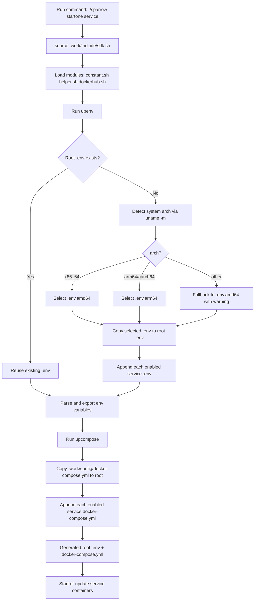

<div align="center"> <h1>Development Document</h1> </div>

## 0. The .work Workspace

### (1) Why this directory exists

The .work directory is Sparrow's internal workspace. It centralizes framework-level assets so service directories stay focused on service logic only.

It mainly solves these problems:

1. Avoid duplicated framework scripts across services.
2. Keep base configuration templates in one place.
3. Build runtime files (.env and docker-compose.yml in project root) from a controlled pipeline.
4. Keep documentation, IDE helpers, testing scripts, and new-service templates together.

### (2) What is inside .work

Key subdirectories and files:

- .work/config
    - .env.amd64: base environment template.
    - .env.arm64: base environment template for arm64.
    - docker-compose.yml: base compose skeleton (common network and top-level structure).
- .work/include
    - sdk.sh: common entry that loads internal modules and triggers config generation.
    - internal/constant.sh: paths and constants.
    - internal/helper.sh: environment parsing, compose generation, utility functions.
    - internal/dockerhub.sh: search, pull, upload image helpers.
- .work/extra
    - doc: project docs (usage, development, QA, contribution).
    - ide: IDE-related resources (vscode, jetbrains).
    - service_example: scaffolding template for creating a new service.
- .work/test
    - run.sh: lightweight integration checks.
- .work/README.md: short description of the workspace purpose.

### (3) How configuration files work

Sparrow does not rely only on static root-level .env and docker-compose.yml. Instead, they are prepared through the .work pipeline.

Flow overview:

1. Your command (for example ./sparrow startone mysql) sources .work/include/sdk.sh.
2. sdk.sh loads constants/helpers/dockerhub modules.
3. helper.sh runs upenv:
     - If root .env does not exist, detect system architecture via `uname -m`: `x86_64` maps to `amd64`, `arm64/aarch64` maps to `arm64`.
     - Copy the matching `.work/config/.env.amd64` or `.work/config/.env.arm64` to root .env.
     - Read ENABLE_SERVICE_LIST from .env.
     - Append each enabled service's {service}/.env into root .env.
     - Parse and export variables for current shell execution.
4. helper.sh runs upcompose:
     - Copy .work/config/docker-compose.yml to root docker-compose.yml.
     - Append each enabled service's {service}/docker-compose.yml (remove duplicated services: header).
5. Sparrow then uses the generated root docker-compose.yml and root .env to start/update services.



### (4) Practical development rules

1. Modify global defaults in .work/config first, then regenerate root files by rerunning Sparrow commands.
2. Modify service-specific variables in {service}/.env and service compose in {service}/docker-compose.yml.
3. If you changed base env templates and want a clean rebuild, remove root .env and rerun Sparrow.
4. Treat root docker-compose.yml as generated output in normal workflow; source-of-truth is .work/config plus service compose files.
5. Platform architecture is detected automatically via `uname -m` when root .env is first generated — no manual selection is needed. To switch platforms, delete root .env and rerun Sparrow on the target machine.

### (5) Typical scenarios

- Add a new service:
    1. Generate from .work/extra/service_example via sparrowtool.
    2. Add service to ENABLE_SERVICE_LIST.
    3. Rerun Sparrow to regenerate root config and start service.
- Change global network/system settings:
    1. Update .work/config/.env.* templates.
    2. Regenerate and validate via Sparrow commands.
- Keep docs and tooling consistent:
    1. Update .work/extra/doc and .work/extra/ide resources.

### (6) CONTAINER_NAMESPACE Design

`CONTAINER_NAMESPACE` is a key isolation variable defined in `.work/config/.env.*`. It is embedded into every container name following the pattern:

```
sparrow_container_{CONTAINER_NAMESPACE}_{service}
```

For example, with `CONTAINER_NAMESPACE=test`:

```
sparrow_container_test_mysql
sparrow_container_test_redis
sparrow_container_test_nginx
```

**Why it exists:**

It allows multiple completely independent Sparrow environments to run on the same machine without conflict. For example:

| Namespace | Typical use |
|-----------|-------------|
| `test` | default local development environment |
| `dev` | another isolated development environment |
| `staging` | staging environment on the same machine |

Because container names are unique per namespace, you can run two separate Sparrow stacks side by side on the same host.

**Where it is used:**

- Every `{service}/docker-compose.yml` sets `container_name: sparrow_container_${CONTAINER_NAMESPACE}_{service}`.
- `stopone` locates the container to stop by constructing `sparrow_container_${CONTAINER_NAMESPACE}_{service}`.
- `clear_service_resources` removes containers and images scoped to the namespace.
- `./sparrow status` outputs the current `CONTAINER_NAMESPACE` value so you always know which environment is active.

**How to switch environments:**

Change `CONTAINER_NAMESPACE` in `.work/config/.env.*`, delete the root `.env`, and rerun Sparrow. Each namespace is fully isolated.

## 1. How to Upload Image

### (1) Upload a Basic Image

Assuming there is a service named ```etcd``` locally, with the image name ```sparrow-basic-etcd``` and version ```3.5.0```. If you want to upload this image to Docker Hub, you need to use the following commands

```bash
./sparrowtool upload -t basic -s etcd -v 3.5.0
```

It must be noted that after upload, the version of the remote image may not be the same as the local version.

- local image version: ```3.5.0```
- remote image version: ```etcd.3.5.0_basic.{{timestamp}}```

The remote version format is ```{service}.{version}_{type}.{timestamp}```, which makes it easy to identify which service, version, and image type the upload belongs to while still preserving history through the timestamp.


In order to prevent the remote image version from being mistakenly replaced, if you want to upload a version same to the local one, you must use the ```-r``` option, it means ```replace```, such as ```-r true```.

```bash
./sparrowtool upload -t basic -s etcd -v 3.5.0 -r true
```

This way, there will be a remote image with version ```3.5.0```.


### (2) Upload a App Image

The usage is the same as above. Without `-r`, the remote version follows the same naming convention:

- local image version: ```latest```
- remote image version: ```etcd.latest_app.{{timestamp}}```

```bash
./sparrowtool upload -t app -s etcd -v latest

./sparrowtool upload -t app -s etcd -v latest -r true
```

## 2. How to Create New Service

### (1) Use Sparrowtool

You can use the ```sparrowtool``` to create new service. If you want to create a ```jupyter``` service, you can use this command bellow.

```bash
# if you forget command, for help.
./sparrowtool --help

./sparrowtool new -t service -s jupyter -p 2300 -v 0.1.0
```

After a successful execution, there will be a directory named ```/jupyter``` under the project root directory.

#### ① Assign a Port Number

If you don't know which port number to use, you add your service(such as ```langchain```) to ```subdirectories=("etcd" "etcdkeeper" ... "langchain")``` of ```search_env()``` in ```sparrowtool``` file. Then run this command bellow.

```bash
./sparrowtool env -l _port 
```

From the image below, you can see that the system has allocated a port range of ```[3300, 3400)``` to the new service langchain.


### (2) Modify Your Service Configuration

You must modify these image variables in ```./jupyter/.env``` file as bellow.

- ```IMAGE_OFFICIAL_JUPYTER_NAME```: the official image name.
- ```IMAGE_OFFICIAL_JUPYTER_VERSION```: \[optional modify\] the official image version, such as ```IMAGE_OFFICIAL_JUPYTER_VERSION=18.19.0```.
- ```IMAGE_BASIC_JUPYTER_VERSION```: \[optional modify\] the basic image version. It is recommended to set the same value as ```IMAGE_OFFICIAL_JUPYTER_VERSION```.
- ```IMAGE_APP_JUPYTER_VERSION```: \[optional modify\] the app image name. It is recommended to set ```latest```

These are must modify variables, if you have another demand, you can modify more in the ```./jupyter``` directory.

### (3) Add Your Service to ENABLE_SERVICE_LIST in Your /.work/config/.env File

The ```ENABLE_SERVICE_LIST``` variables is defined in ```/.work/config/.env.amd64``` or ```/.work/config/.env.arm64``` file, you should add ```jupyter``` the new service to the variable.

```
ENABLE_SERVICE_LIST=("xxx" "xxx" "jupyter")
```

### (4) Delete /.env File

After that, you should delete ```/.env``` file in the root path of your project, because an updated ```/.env``` file can be automatically generated in a while.

### (5) Start Service

Now, you can enjoy the service use the following command.

```bash
./sparrow startone jupyter
```

Of course, if you need to make some custom modifications to the image, you can update the service ! Please continue to the next part: [How to update a service](#3How-to-update-a-service) doc

## 3、How to Update a Service

When the content of the image needs to be modified to support new requirements, the services need to be updated, which is actually updating the image.

### (1) Update a Service

```bash
./sparrow updateone {service}
```

### (2) Usage Example

When we need to adjust the Go version to ```1.17.0``` (default is 1.21.1), follow these steps:

1. First, modify the official image: change ```IMAGE_OFFICIAL_GO_VERSION=1.21.1``` in the ```/.env``` file to ```IMAGE_OFFICIAL_GO_VERSION=1.17.0```.
2. Then, modify the basic image: change ```IMAGE_BASIC_GO_VERSION=1.21.1``` in the ```/.env``` file to ```IMAGE_BASIC_GO_VERSION=1.17.0```.
3. Finally, update the go service: execute ```./sparrow updateone go```.

## 4. Image Types and Relationship

This project uses a layered image strategy for every service. The final container is always started from an app image, while basic and official images are used as upstream layers.

### (1) Image Types

- Official image: upstream base image from Docker Hub (for example, mysql:8.0).
- Basic image: project-level base image, named as sparrow-basic-{service}:{version}.
- App image: runnable service image, named as sparrow-app-{service}:{version}.

### (2) Naming and Version Variables

- IMAGE_OFFICIAL_{SERVICE}_NAME and IMAGE_OFFICIAL_{SERVICE}_VERSION define the upstream image.
- IMAGE_BASIC_{SERVICE}_VERSION defines the basic image version.
- IMAGE_APP_{SERVICE}_VERSION defines the app image version.

Example for MySQL:

- IMAGE_OFFICIAL_MYSQL_NAME=mysql
- IMAGE_OFFICIAL_MYSQL_VERSION=8.0
- IMAGE_BASIC_MYSQL_VERSION=8.0
- IMAGE_APP_MYSQL_VERSION=latest

### (3) Build and Pull Workflow

When you run ./sparrow startone {service}, Sparrow follows this order:

1. Pull app image from remote repository with `--platform ${FROM_PLATFORM}` to ensure the correct architecture is fetched.
2. If app pull fails, build app image locally.
3. Before building app image, try to pull basic image (also with `--platform ${FROM_PLATFORM}`).
4. If basic pull fails, build basic image locally from official image using `--build-arg FROM_PLATFORM`, which maps to `FROM --platform=${FROM_PLATFORM}` in the Dockerfile.
5. Start container by docker compose using app image; every service `docker-compose.yml` sets `platform: ${FROM_PLATFORM}` to enforce the correct architecture at runtime.

In short:

Official image -> Basic image -> App image -> Container runtime

`FROM_PLATFORM` is applied at every stage: pull, build, and compose run.

### (4) Why Keep Basic and App Separate

- Better cache reuse: common layer changes less frequently.
- Faster service iteration: app layer can change without rebuilding everything.
- Cleaner responsibility split: basic for runtime base, app for service-specific startup settings.
- Easier image distribution: you can upload basic and app independently.

### (5) Which Image Is Used by docker-compose

The service definitions in docker-compose.yml use sparrow-app-* images directly. This means:

- basic images are build-time dependencies.
- app images are runtime dependencies.

Each service's docker-compose.yml includes `platform: ${FROM_PLATFORM}`, which is resolved from the root `.env` generated during startup. This ensures Docker always enforces the correct platform when creating the container, regardless of the host machine's native architecture.

### (6) Development Recommendations

1. If you upgrade an upstream runtime version, update both official and basic versions to the same value first.
2. Rebuild service with ./sparrow updateone {service}.
3. Keep IMAGE_APP_{SERVICE}_VERSION as latest for local development unless you need explicit version pinning.
4. Push images with ./sparrowtool upload when you need team or CI/CD reuse.
5. Never skip the `FROM_PLATFORM` variable. Omitting it from pull, build, or compose will cause Docker to silently use the host's native architecture, leading to architecture mismatches when images are shared across amd64 and arm64 machines.

### (7) Typical Commands

```bash
# Start one service (tries pull, then build fallback)
./sparrow startone mysql

# Rebuild and restart one service
./sparrow updateone mysql

# Upload basic/app image
./sparrowtool upload -t basic -s mysql -v 8.0
./sparrowtool upload -t app -s mysql -v latest
```

## 5、How Nginx Proxy Pass Server


### (1) Container Config

```
GO_HOST_PORT=8002 # port number of the host that deployed the go service.
GO_CONTAINER_PORT=8001 # port number of go container

NGINX_HOST_GO_PROXY_PORT=8004 # the host port number for nginx proxying the go service.
NGINX_CONTAINER_GO_PROXY_PORT=8003 # the container port number for nginx proxying the go service.
```

### (2) Proxy Config

```conf
server {
    listen {{go_proxy_port}};

    location / {
        proxy_pass http://{go_server_addr}:{{go_server_port}};
        proxy_set_header Host $host;
        proxy_set_header X-Real-IP $remote_addr;
        proxy_set_header X-Forwarded-For $proxy_add_x_forwarded_for;
        proxy_set_header X-Forwarded-Proto $scheme;
    }

    error_log /var/log/nginx/nginx_error.log;
    access_log /var/log/nginx/goproxy_access.log;
}
```

## 6、The Mounting of Service on The Host

### (1) Service Directory Mounting

Each service directory will be mounted to the /home/sparrow/{service} directory of the container.

### (2) Data Directory Mounting
Each service has a ```data``` directory, which is the only data channel from the host to the container. For example

- the persistent data of databases like MySQL and Redis will be mounted to their ```data``` directories.
- projects based on environments such as Python/PHP/Go will be mounted to their ```ata``` directories.
