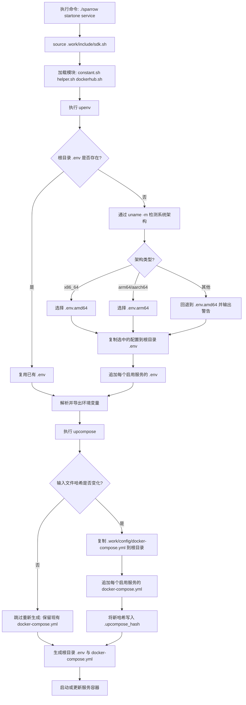

<div align="center"> <h1>开发文档</h1> </div>

## 1. .work 目录说明

### (1) 这个目录是为了什么

.work 是 Sparrow 的内部工作空间目录，用来集中管理框架级资源，让各服务目录专注于服务本身。

它主要解决以下问题：

1. 避免框架脚本在每个服务目录重复维护。
2. 将基础配置模板集中管理，减少配置漂移。
3. 通过统一流水线生成根目录运行配置（.env 和 docker-compose.yml）。
4. 将文档、IDE 资源、测试脚本、新服务模板统一放置，便于维护和协作。

### (2) .work 下有哪些内容

核心子目录与文件如下：

- .work/config
	- .env.amd64：基础环境变量模板。
	- .env.arm64：arm64 基础环境变量模板。
	- docker-compose.yml：基础 compose 骨架（公共网络和顶层结构）。
- .work/include
	- sdk.sh：统一入口，加载内部模块并触发配置生成。
	- internal/constant.sh：常量与路径定义。
	- internal/helper.sh：环境解析、compose 生成、通用辅助函数。
	- internal/dockerhub.sh：镜像搜索、拉取、上传相关函数。
- .work/extra
	- doc：项目文档（使用、开发、QA、贡献）。
	- ide：IDE 相关资源（vscode、jetbrains）。
	- service_example：新服务脚手架模板。
- .work/test
	- run.sh：轻量集成检查脚本。
- .work/README.md：对该工作区目录的简要说明。

### (3) 配置文件如何工作

Sparrow 不是只依赖静态的根目录 .env 与 docker-compose.yml，而是通过 .work 的流水线进行生成与更新。

流程如下：

1. 执行命令（例如 ./sparrow startone mysql）时，会先 source .work/include/sdk.sh。
2. sdk.sh 加载 constant/helper/dockerhub 模块。
3. helper.sh 执行 upenv：
	 - 若根目录 .env 不存在，通过 `uname -m` 自动检测当前机器架构：`x86_64` 对应 `amd64`，`arm64/aarch64` 对应 `arm64`。
	 - 根据检测结果复制对应的 `.work/config/.env.amd64` 或 `.work/config/.env.arm64` 到根目录 .env。
	 - 从 .env 中读取 ENABLE_SERVICE_LIST。
	 - 将每个启用服务的 {service}/.env 追加到根目录 .env。
	 - 解析并导出环境变量供当前命令执行。
4. helper.sh 执行 upcompose：
	 - 计算所有输入文件的 md5 哈希：根目录 .env + .work/config/docker-compose.yml + 每个启用服务的 {service}/docker-compose.yml。哈希计算优先使用 `md5sum`（Linux），其次使用 `md5`（macOS）；若两者均不可用，则跳过哈希检查，每次都重新生成。
	 - 与项目根目录 `.upcompose_hash` 中存储的哈希进行比对。
	 - 若哈希未变化，跳过重新生成（对根目录 docker-compose.yml 的手动修改将被保留）。
	 - 若哈希变化，重新生成：复制 .work/config/docker-compose.yml 到根目录，追加各服务 compose 文件（去掉重复的 services: 头），最后将新哈希写入 `.upcompose_hash`。
5. Sparrow 最终基于根目录生成后的 .env 与 docker-compose.yml 启动或更新服务。



### (4) 开发时建议遵循的规则

1. 全局默认项优先修改 .work/config，再通过执行 Sparrow 命令触发重新生成。
2. 服务级配置放在 {service}/.env 与 {service}/docker-compose.yml。
3. 若修改了基础 env 模板并希望彻底重建，可删除根目录 .env 后重新执行 Sparrow。
4. 根目录 docker-compose.yml 仅在输入文件变化时才重新生成（基于哈希比对：根目录 .env + .work/config/docker-compose.yml + 各服务 compose 文件）。哈希计算优先使用 `md5sum`（Linux），其次使用 `md5`（macOS）；若均不可用则跳过比对，始终执行重新生成。只要输入未变化，对根目录 docker-compose.yml 的手动修改会被保留。哈希值存储在项目根目录的 `.upcompose_hash` 文件中。
5. 平台架构由 `uname -m` 在首次生成根目录 .env 时自动检测，无需手动指定。如需切换平台，删除根目录 .env 后在目标机器上重新执行 Sparrow 即可。

### (5) 常见场景

- 新增服务：
	1. 使用 .work/extra/service_example 通过 sparrowtool 生成服务。
	2. 将服务加入 ENABLE_SERVICE_LIST。
	3. 重新执行 Sparrow，自动生成根配置并启动服务。
- 修改全局网络或系统配置：
	1. 更新 .work/config/.env.* 模板。
	2. 通过 Sparrow 命令重新生成并验证。
- 同步文档和开发环境：
	1. 更新 .work/extra/doc 与 .work/extra/ide 下资源。

### (6) CONTAINER_NAMESPACE 命名空间设计

`CONTAINER_NAMESPACE` 是定义在 `.work/config/.env.*` 中的关键隔离变量，嵌入到每个容器名称中，命名规则为：

```
sparrow_container_{CONTAINER_NAMESPACE}_{service}
```

例如，当 `CONTAINER_NAMESPACE=test` 时：

```
sparrow_container_test_mysql
sparrow_container_test_redis
sparrow_container_test_nginx
```

**设计目的：**

允许同一台机器上运行多套完全独立的 Sparrow 环境，互不干扰。例如：

| 命名空间 | 典型用途 |
|----------|----------|
| `test` | 默认本地开发环境 |
| `dev` | 另一套独立的开发环境 |
| `staging` | 同机器上的预发布环境 |

由于容器名在命名空间内唯一，可以在同一台机器上并行运行两套完整的 Sparrow 栈。

**使用位置：**

- 每个 `{service}/docker-compose.yml` 都设置了 `container_name: sparrow_container_${CONTAINER_NAMESPACE}_{service}`。
- `stopone` 通过拼接 `sparrow_container_${CONTAINER_NAMESPACE}_{service}` 定位要停止的容器。
- `clear_service_resources` 按命名空间范围清理容器和镜像。

**如何切换环境：**

修改 `.work/config/.env.*` 中的 `CONTAINER_NAMESPACE`，删除根目录 `.env`，重新执行 Sparrow 即可。每个命名空间完全隔离。

## 2. 镜像类型与关系

本项目对每个服务采用分层镜像策略。容器最终总是基于 app 镜像启动，basic 和 official 镜像是其上游构建层。

### (1) 镜像类型

- 官方镜像（official image）：来自 Docker Hub 的上游基础镜像，例如 mysql:8.0。
- 基础镜像（basic image）：项目级基础镜像，命名规则为 sparrow-basic-{service}:{version}。
- 应用镜像（app image）：最终运行镜像，命名规则为 sparrow-app-{service}:{version}。

### (2) 命名与版本变量

- IMAGE_OFFICIAL_{SERVICE}_NAME 与 IMAGE_OFFICIAL_{SERVICE}_VERSION：定义上游官方镜像。
- IMAGE_BASIC_{SERVICE}_VERSION：定义 basic 镜像版本。
- IMAGE_APP_{SERVICE}_VERSION：定义 app 镜像版本。

以 MySQL 为例：

- IMAGE_OFFICIAL_MYSQL_NAME=mysql
- IMAGE_OFFICIAL_MYSQL_VERSION=8.0
- IMAGE_BASIC_MYSQL_VERSION=8.0
- IMAGE_APP_MYSQL_VERSION=latest

### (3) 拉取与构建流程

当执行 ./sparrow startone {service} 时，Sparrow 的处理顺序如下：

1. 先尝试从远端拉取 app 镜像，拉取时携带 `--platform ${FROM_PLATFORM}` 参数，确保拉取的是正确架构的镜像。
2. 如果 app 拉取失败，则在本地构建 app 镜像。
3. 构建 app 前，先尝试拉取 basic 镜像（同样携带 `--platform ${FROM_PLATFORM}`）。
4. 如果 basic 拉取失败，则基于 official 镜像在本地构建 basic 镜像，构建时通过 `--build-arg FROM_PLATFORM` 传入架构参数，对应 Dockerfile 中的 `FROM --platform=${FROM_PLATFORM}`。
5. 最后通过 docker compose 使用 app 镜像启动容器；每个服务的 `docker-compose.yml` 均设置了 `platform: ${FROM_PLATFORM}`，确保容器运行时的架构正确。

可概括为：

Official image -> Basic image -> App image -> Container runtime

`FROM_PLATFORM` 贯穿 pull、build、compose 三个阶段，确保全链路架构一致。

### (4) 为什么拆分 basic 与 app

- 更好利用构建缓存：公共层变化频率更低。
- 提升迭代效率：业务层变更时通常不需要重建全部基础层。
- 职责更清晰：basic 负责运行时基础，app 负责服务级配置和启动。
- 分发更灵活：basic 与 app 可独立上传与复用。

### (5) docker-compose 实际使用哪一层

docker-compose.yml 里的服务镜像直接使用 sparrow-app-*，因此：

- basic 镜像是构建期依赖。
- app 镜像是运行期依赖。

每个服务的 docker-compose.yml 中均包含 `platform: ${FROM_PLATFORM}`，该值从启动时生成的根目录 `.env` 中读取。这确保了无论宿主机是何种原生架构，Docker 在创建容器时都会强制使用正确的平台。

### (6) 开发建议

1. 升级上游运行时版本时，优先同步调整 official 与 basic 版本号。
2. 使用 ./sparrowtool update {service} 完成重建并重启。
3. 本地开发建议 IMAGE_APP_{SERVICE}_VERSION 使用 latest；发布追踪场景再固定版本。
4. 团队协作或 CI/CD 复用时，使用 ./sparrowtool upload 上传镜像。
5. 不要遗漏 `FROM_PLATFORM` 变量。在 pull、build 或 compose 阶段缺少该参数，Docker 会静默使用宿主机的原生架构，在 amd64 与 arm64 机器之间共享镜像时会导致架构不匹配的问题。

### (7) 常用命令

```bash
# 启动单服务（优先拉取，失败则本地构建）
./sparrow startone mysql

# 重建并重启单服务
./sparrowtool update mysql

# 上传 basic/app 镜像
./sparrowtool upload -t basic -s mysql -v 8.0
./sparrowtool upload -t app -s mysql -v latest
```

## 3. Nginx 如何反向代理服务


### (1) 容器配置

```
GO_HOST_PORT=8002 # 部署 go 服务的宿主机端口
GO_CONTAINER_PORT=8001 # go 容器端口

NGINX_HOST_GO_PROXY_PORT=8004 # nginx 代理 go 服务的宿主机端口
NGINX_CONTAINER_GO_PROXY_PORT=8003 # nginx 代理 go 服务的容器端口
```

### (2) 代理配置

```conf
server {
	listen {{go_proxy_port}};

	location / {
		proxy_pass http://{go_server_addr}:{{go_server_port}};
		proxy_set_header Host $host;
		proxy_set_header X-Real-IP $remote_addr;
		proxy_set_header X-Forwarded-For $proxy_add_x_forwarded_for;
		proxy_set_header X-Forwarded-Proto $scheme;
	}

	error_log /var/log/nginx/nginx_error.log;
	access_log /var/log/nginx/goproxy_access.log;
}
```

## 4. 服务在宿主机上的挂载

### (1) 服务目录挂载

每个服务目录都会挂载到容器中的 /home/sparrow/{service} 目录。

### (2) data 目录挂载

每个服务都有一个 data 目录，这是宿主机与容器之间最核心的数据通道。例如：

- MySQL、Redis 等数据库的持久化数据会挂载到各自的 data 目录。
- Python/PHP/Go 等开发环境项目也会挂载到对应的 data 目录。
